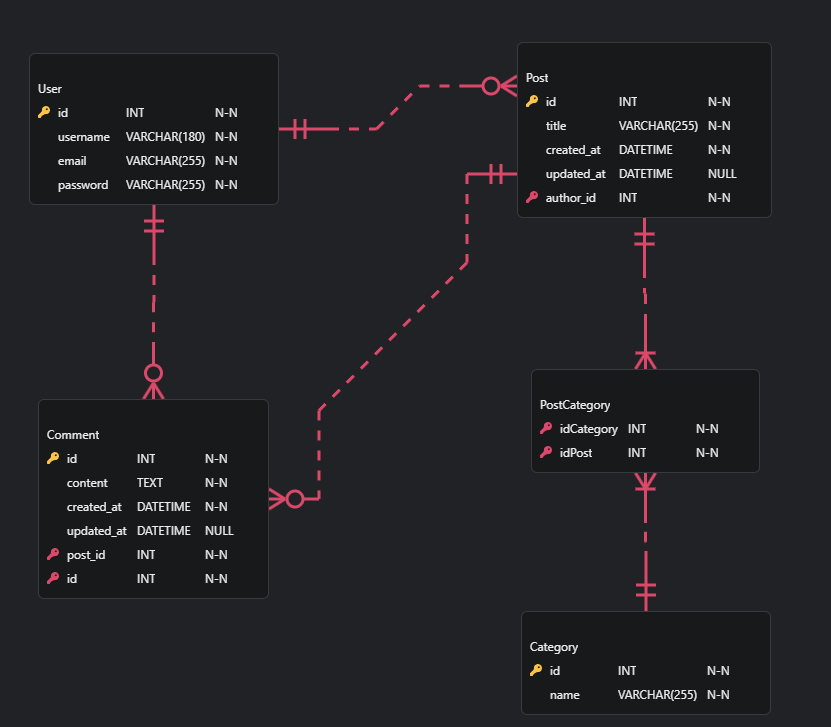

# Blogging Platform API

## Objectif

L'objectif de ce projet est de :
- Mettre en pratique les opérations CRUD (Create, Read, Update, Delete) pour gérer les articles de blog, les utilisateurs et les commentaires.
- Implémenter une authentification sécurisée pour protéger l'accès aux ressources et permettre aux utilisateurs de s'identifier et de s'autoriser.
- Respecter l'architecture RESTful pour la conception de l'API afin de garantir une interopérabilité, une flexibilité et une maintenabilité maximales.
- Fournir une solution backend robuste et flexible pour une plateforme de blogging personnel, incluant la gestion des catégories d'articles et la possibilité d'ajouter des images aux articles.

## Description

Ceci est une API RESTful qui alimente une plateforme de blog personnel. L'API permet de :
- Récupérer une liste d'articles.
- Récupérer un article spécifique par son ID.
- Créer un nouvel article.
- Supprimer un article spécifique par son ID.
- Mettre à jour un article spécifique par son ID.

## Modèle de Données

Voici un diagramme du modèle de données de l'API de blogging personnel :



## Stack Utilisée

- **Backend** : PHP avec le framework Symfony
- **Base de données** : PostgreSQL
- **Serveur web** : Nginx
- **Gestion des dépendances** : Composer
- **Sécurité** : SSL avec Let's Encrypt (pour HTTPS)
- **Testing** : PHPUnit pour les tests unitaires

## Fonctionnalités Pertinentes

1. **Gestion des Utilisateurs**
   - Inscription des utilisateurs.
   - Authentification et autorisation.
   - Gestion des profils utilisateurs.

2. **Gestion des Articles**
   - Création, lecture, mise à jour et suppression des articles (CRUD).
   - Ajout de tags et de catégories aux articles.
   - Ajout d'images aux articles.

3. **Gestion des Commentaires**
   - Création, lecture, mise à jour et suppression des commentaires.
   - Modération des commentaires.

4. **Gestion des Catégories**
   - Création, lecture, mise à jour et suppression des catégories.

5. **Sécurité et Authentification**
   - Utilisation de JWT (JSON Web Tokens) pour sécuriser les endpoints.
   - Gestion des rôles et des permissions des utilisateurs.

6. **Recherche et Filtrage**
   - Recherche d'articles par titre, contenu, auteur ou tags.
   - Filtrage des articles par date de publication, catégories, etc.

7. **Documentation de l'API**
   - Génération de documentation de l'API avec swagger
   
## Installation

### Prérequis

- PHP >= 8.2
- Composer
- MySQL ou PostgreSQL

### Étapes

1. Clonez le dépôt :
   ```bash
   git clone https://github.com/Chris4B/Personal_Blog_Api
   cd Personal_Blog_Api
